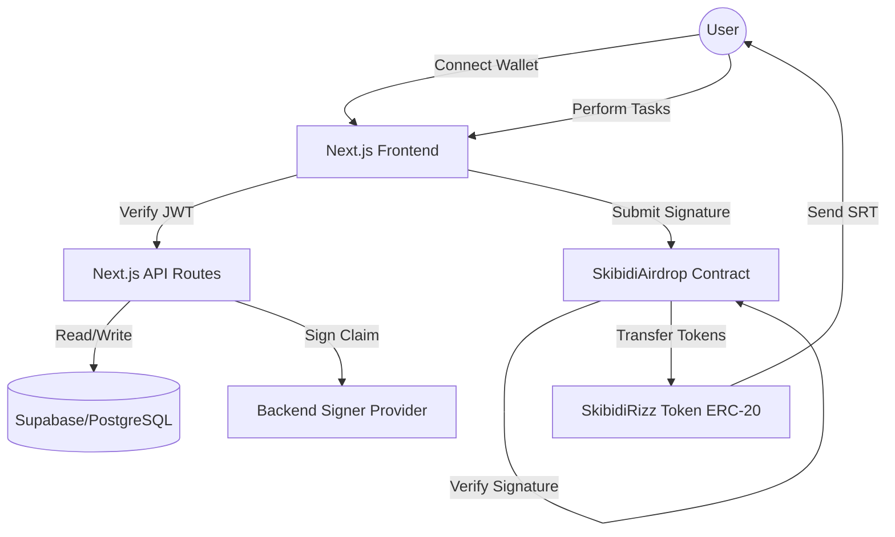

# 🏗 Project Architecture - SkibidiRizz Ecosystem

> **Note:** This is a simplified architecture designed for an academic project demonstrating Web3 and Fintech concepts.

## 1. System Overview
The SkibidiRizz ecosystem is a **Hybrid Web3 Application** (dApp) that combines traditional web technologies (PostgreSQL, Next.js) with decentralized blockchain technology (Ethereum Sepolia, Smart Contracts).

---

## 2. Core Components

### A. Blockchain Layer (Ethereum Sepolia)
*   **SkibidiRizzToken (SRT)**: A standard ERC-20 token with a fixed supply of 1,000,000.
*   **SkibidiAirdrop**: A distribution contract that uses **ECDSA Cryptographic Signatures** for authorization. It ensures each user can only claim once and only with a valid server-side signature.

### B. Backend Layer (Next.js & Prisma)
*   **Authentication (SIWE)**: Uses *Sign-In with Ethereum* to authenticate users via their wallets. No passwords are stored; security relies on cryptographic message signing.
*   **Task Engine**: Manages user points and task status. Tasks are stored in a database to avoid excessive blockchain gas fees for simple actions.
*   **Signature Provider**: A secure backend service that holds the `ADMIN_PRIVATE_KEY` to authorize legitimate claims.

### C. Database Layer (Supabase)
*   **User Table**: Stores wallet addresses and total accumulated points.
*   **Task Log**: Tracks which users have completed which tasks.
*   **Claim Log**: Audits all signature requests to prevent double-spending attempts at the API level.

---

## 3. Data Flow: The "Task-to-Earn" Loop

### Step 1: Authentication
1. User connects wallet.
2. Server provides a unique **Nonce**.
3. User signs the nonce with their private key (MetaMask).
4. Server verifies signature and issues a **JWT** (JSON Web Token) stored in a secure cookie.

### Step 2: Earning Points
1. User clicks "Visit Link" or "Follow Socials".
2. Frontend notifies API.
3. API verifies task completion and updates the user's points in the **PostgreSQL** database.

### Step 3: Claiming Tokens (Web3 Bridge)
1. User clicks "Claim".
2. API checks if user has enough points and hasn't claimed before.
3. API uses the `ADMIN_PRIVATE_KEY` to sign a message containing `{userAddress, amount}`.
4. Signature is returned to the Frontend.
5. User sends a transaction to the `claimTokens` function on the Smart Contract, passing the signature.
6. **Smart Contract** verifies the signature using `ecrecover`. If valid, it sends tokens directly to the user's wallet.

---

## 4. Security Philosophy
For this academic project, we prioritized **Hybrid Security**:
1.  **Sybil Resistance**: Wallet connection and task-based earning make it expensive for bots to farm tokens.
2.  **Gas Efficiency**: By keeping task logic off-chain and only using the blockchain for the final claim, we reduce costs by over 90% compared to fully on-chain systems.
3.  **Cryptographic Integrity**: The use of ECDSA ensures that even if the Frontend is compromised, the Smart Contract will only release tokens for signatures authorized by our backend.

---
*Version 2.0 | Academic Final Project Revision*
